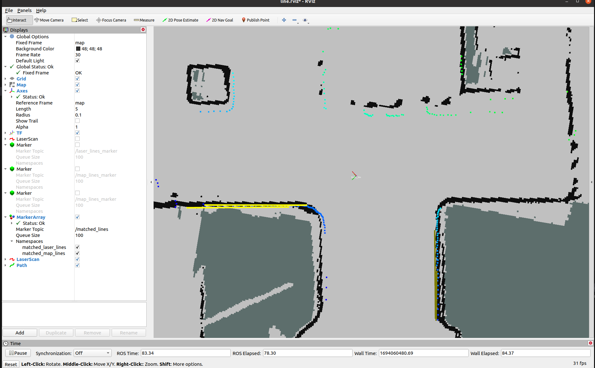

## 

Based on the commands you've given, I'm assuming you have a ROS package named `laser_line` that performs line extraction from laser data and a grid map, matches these lines, and visualizes the results.

Here's a basic `README.md` structure for your `laser_line` ROS package:

---

## Laser Line Extraction and Matching

This ROS package, `laser_line`, is designed for extracting line segments from laser data and grid maps. After extraction, the lines are matched and visualized.

### Prerequisites

- ROS (e.g., ROS Noetic). Replace with your ROS version if different.
- Other dependencies (List other dependencies if any)  (glog, libdw-dev)

### Installation

1. Navigate to your ROS workspace. For example:
   ```
   cd ~/catkin_ws/src
   ```

2. Clone the repository:
   ```
   git clone https://github.com/kintzhao/align_lines_angle_by_laser_and_gridmap.git
   ```

3. Compile:
   ```
   cd ~/catkin_ws && catkin_make
   ```

4. Source your workspace:
   ```
   source ~/catkin_ws/devel/setup.bash
   ```

### Usage

1. **Laser Line Extraction**:
   Launch the line extraction node for laser data:
   
   ```
   roslaunch laser_line laser_line.launch
   ```
   
2. **Grid Map Line Extraction**:
   Extract lines from the grid map with:
   ```
   rosrun laser_line extract_line_from_map
   ```

3. **Line Segment Matching**:
   Match the extracted line segments and adjust angles:
   ```
   rosrun laser_line match_line_node
   ```

4. **Visualization**:
   To visualize the matched line segments, run:
   ```
   roslaunch laser_line show.launch
   ```

---

 




### Acknowledgements

======================================

Extract the line from laser :  https://github.com/NKU-MobFly-Robotics/laser-line-segment.git

Extract the line from map :  LSD
 https://github.com/kailigo/LineSegmentMatching.git 

match_by_ceres: https://github.com/xiaoxiaotao/ceres_lm_pl_icp.git
